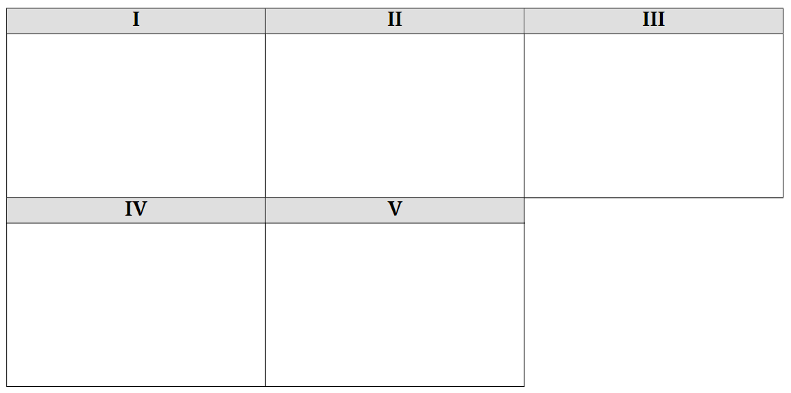

# Краткое руководство

## Как начать оформлять задачи?

1. Зарегистрируйтесь на сайте [overleaf.com](https://overleaf.com). Этот ресурс позволяет быстро компилировать код LaTeX и видеть как будет выглядеть оформление вашей задачи.
1. [Скачайте последнюю версию шаблона заданий, решений и бланка ответов](https://github.com/Beyond-Curriculum/qazcho-latex/releases/). В последней версии все три шаблона объединены в одном `.zip`-файле "example.zip".
1. На сайте [overleaf.com](https://overleaf.com) нажмите на кнопку **New Project** и выберите опцию **Upload Project**.
1. Загрузите файл "example.zip".
1. Как только откроется проект, сайт попытается скомпилировать его. Вы увидите ошибки компиляции --- не пугайтесь. Нажмите на кнопку **Menu** в левом верхнем углу. Откроется боковое меню. Найдите параметр **Compiler** --- по умолчанию выбран **pdfLaTeX**. Выберите **XeLaTeX** и нажмите на кнопку **Recompile**. Теперь вы увидите пдф версию вашего файла.

Дальше рассмотрим инструкции по каждому файлу по отдельности.

Но перед этим небольшая ремарка. В папке [example](/example) есть примеры оформленных условий ("author-task.tex"), решений ("author-sol.tex") и листов ответов ("author-blank.tex"). Вы можете пользоваться ими как справочным ресурсом. Можете прям копировать код задачи и начинать его модифицировать при оформлении своей задачи.

## Как работает LaTeX?

Рекомендуем прочитать [вводный урок от Overleaf](https://www.overleaf.com/learn/latex/Learn_LaTeX_in_30_minutes).

Основная суть: в `great-problem/main.tex` пишем условие задачи обычным текстом. Каждый новый параграф отделяется пустой строкой. Мы можем писать числа обычным текстом. Если мы хотим указать единицы измерения -- мы пользуемся специальной командой (полный список единиц измерения [см. в секции Единицы измерения](#единицы-измерения)). Например `2.379\unit{\angstrom}` или `40.38 \unit{\kjmol}`.

Помимо этого, в LaTeX есть math mode. Может быть `inline`, а может быть `display`. `Inline` позволяет писать формулы прям внутри параграфа. `Display` пишет формулы на отдельной строке и автоматически добавляем к ним нумерацию. Чтобы войти в `inline` режим достаточно обернуть текст знаками доллара. Например: `$\Delta G$`. [В этой теме можно посмотреть](https://ask.bc-pf.org/t/kak-pisat-formuly-yazyk-razmetki-latex/1296) всю красоту math режима.

В math режиме можно прописывать любые греческие буквы словами. Например `\rho`, `\pi`, `\Delta`. Если с заглавной буквы -- получите заглавную греческую букву. Вам не нужно каждый раз бегать в гугл и копировать символ `\alpha`, можно просто написать его самому.

В math режиме также можно вводить химические формулы и реакции внутри среды `\ce{}`. Например `$\ce{H2O + SO2 -> H2SO4}$`. См. инструкцию [по mhchem](#химические-формулы).

В math режиме очень легко делать индексы и суперскрипты. Индексы обозначаются нижним пробелом, суперскрипты стрелкой вверх. Например: `\Delta_r H^0`. Если вы хотите прописать больше одного символа в индекс/суперскрипт, вам надо обернуть его в фигурные скобки. Например `H^{298}`.

Чтобы сделать дробь пользуемся формулой `\frac{}{}`, где в первую фигурную скобку идет все, что должно быть в числителе, а во вторую все, что должно быть в знаменателе. Для знака умножения можно использовать `\cdot` или `\times`.

Если вы строите большую формулу с дробями и скобками, например `(\frac{2}{3})^{0.5}`, вы заметите, что скобки будут неприлично маленькими. Это можно исправить добавлением команд `\left` и `\right`. Например `\left(\frac{2}{3} \right)^{0.5}`. Тоже самое можно делать и с квадратными скобками: `\left[ \right]`.

## Работа с шаблонами

### Выбор языка документа

Самым первым делом надо указать язык, на котором будет написан документ. В зависимости от того, какой язык выбран, результаты введенных команд будут слегка отличаться. Если хотите подготовить документ на казахском языке, в содержании документа надо прописать команду `\SetLanguage{Kazakh}`. Если хотите подготовить документ на русском языке, надо прописать команду `\SetLanguage{Russian}`.

### Выбор шаблона

Сразу после выбора языка, на котором будет написан документ, надо выбрать шаблон, который будет использоваться. Если хотите создать документ условий заданий, надо прописать команду `\UsingTemplate{Tasks}`. Для решений в аргументе этой команды надо прописать "Solutions" (`\UsingTemplate{Solutions}`), а для листов ответов --- "Blank".

#### Выбор типа тура

По умолчанию, шаблон пишется для теоретического тура, поэтому в верхнем колонтитуле будет написано, что задачи, листы ответов или решения относятся к теоретическому туру. Но если прописать команду `\Practical`, верхний колонтитул поменяется, и будет написано, что документ относится к практическому туру.

### Общие команды для шаблонов

В этой секции расписаны команды, которые являются общими для всех шаблонов --- у них одинаковое название, синтаксис и вывод.

#### Титульный лист

Титульный лист генерируется командой `\titlepage`, которая принимает 4 аргумента:

1. Этап (например, "Районный" или "Аудандық")
2. Учебный год (например, "2022-2023")
1. Класс учеников, для которых пишется документ (например, "10")
1. Название файла (например, "chem10-1-tasks")

На титульном листе автоматически будет сгенерирован нужный текст и периодическая таблица.

#### Содержание

С помощью команды `\tableofcontents` можно сгенерировать страницу с содержанием документа.

#### Регламент олимпиады

Про команды `\include` и `\input` можете прочесть в [этом гайде от Overleaf](https://www.overleaf.com/learn/latex/Management_in_a_large_project). Вкратце, эти команды вставляют в основной файл `main.tex` код из других нужных файлов. Отличие в том, что команда `\include` вставляет разрыв страниц перед тем, как вставить содержание в документ.

Для добавления страницы с регламентом олимпиады нужно ввести команду `\include{regulations-rus}` или `\include{regulations-kaz}`, в зависимости от того, на каком языке пишется документ.

#### Названия задач

Для названия задачи надо прописывать команду `\problem{}{}`. Она принимает два аргумента: название задачи (без номера) и ее вес (без знака процента).

##### Задачи с подзадачами

Если задача разделена на подзадачи, надо использовать команду `\subproblem{}`. В ее аргументе номер подзадачи писать надо. Пример:

```latex
\subproblem{Подзадача 1. Реакция второго порядка.}
```

#### Таблицы с баллами

Для таблицы с баллами есть команды `\ProblemPoints[Число от 1 до 7]`. Число в названии команды --- количество пунктов в задаче. К примеру команда `\ProblemPointsSeven{2}{3}{3}{4}{4}{2}{3}{21}{8}` создаст таблицу для задачи с 7 пунктами. Первые 7 аргументов --- баллы за каждый пункт, 8-й аргумент --- общая сумма баллов, 9-й аргумент --- вес задачи. Во всех этих командах аргументы --- это просто значения в нижней строке таблицы по порядку.

Если в задаче больше 7 пунктов или задача разделена на подзадачи, надо делать таблицу вручную. Но чтобы на это не уходило много времени, можно просто сгенерировать код для нужной таблицы. Для этого создаем аккаунт на [Replit](https://replit.com/) и переходим по [ссылке](https://replit.com/join/fqvczrwown-drmrmld), чтобы открылся доступ на редактирование репла.

Редактировать надо и можно только две строки --- определение `table_headers` и `table_values`. Первое --- лист с названиями полей таблицы, второе --- записи этой полей. После того, как отредактировали эти листы, надо нажать "Run" (`Cmd/Ctrl+Enter`)[^1]. Во вкладке Files будет файл `problem-points-table.tex`, в нем код, который надо просто скопировать и вставить после названия задачи в латехе. Если нужно уменьшить размер шрифта в таблице, в сгенерированном коде находим команду `\small` (она всегда в самом начале второй строки) и меняем на одну из следующих команд (отсортированы в порядке уменьшения): `\footnotesize`, `\scriptsize`, `\tiny`.

#### Таблицы в задаче

Для таблиц в задаче вместо стандартной среды (environment) `table` используется модифицированная `Table`, она автоматически ставит таблицу в том месте, где она находится в коде и увеличивает отступы внутри таблицы. Внутри нее надо использовать не стандартную среду `tabular`, а `tabularx`.

```latex
\begin{Table}
  \centering
  \begin{tabularx}{0.8\textwidth}{|Y|Y|Y|Y|}
    \hline
    $\omega (\mathbf{A})$ & $\omega (\mathbf{C})$ & $\omega (\mathbf{O})$ & $\omega (\mathbf{H})$ \\
    \hline
    26.28\% & 22.98\% & 45.92\% & 4.82\% \\
    \hline
  \end{tabularx}
\end{Table}
```

В среду `tabularx` передаем два аргумента: ширина таблицы и вид ячеек. Используем `Y` если надо, чтобы ячейка выравнивалать по центру и `X` --- если надо выравнивание по левой стороне.

Замечание: среда `Table` является так называемым float-объектом, поэтому ее не получится использовать в среде `solbox`, о которой пойдет речь [позже](#команды-для-шаблона-решений). Вместо этого можно просто использовать `tabularx` вне среды `Table`.

#### Изображения в задаче

Изображения добавляются почти так же, как и всегда, просто используется `[H]`, чтобы изображение поместилось в порядке, указанном в коде.

```latex
\begin{figure}[H]
  \centering
  \includegraphics[width=\textwidth]{problems/problem4/images/image1}
\end{figure}
```

Замечание: среда `figure` является так называемым float-объектом, поэтому ее не получится использовать в среде `solbox`, о которой пойдет речь [позже](#команды-для-шаблона-решений). Вместо этого можно просто использовать команду `\includegraphics` вне среды `figure`.

#### Единицы измерения

Для единиц измерения используется пакет `siunitx`. Можно использовать команды `\qty{}{}` (в math mode) и `\unit{}` (в обычном режиме) Примеры использования:

```latex
Плотность воды равна $\rho = \qty{1000}{\kilo\gram\per\meter\cubed}$
Константа скорости равна $k_1 = \qty{0.0042}{\liter\per\mole\per\second}$

Плотность воды равна $\rho = 1000~\unit{\kilo\gram\per\meter\cubed}$
Константа скорости равна $k_1 = 0.0042~\unit{\liter\per\mole\per\second}$
```

Для удобства я создал сокращенные команды для часто используемых единиц измерения:

| Сокращенная команда | Полная команда | Вывод |
|---------------------|----------------|-------|
| `\lmols` | `\liter\per\mole\per\second`  | л моль<sup>-1</sup> с<sup>-1</sup>              |
| `\gcm`   | `\gram\per\centi\meter\cubed` | г см<sup>-3</sup>                               |
| `\gml`   | `\gram\per\milli\liter`       | г мл<sup>-1</sup>                               |
| `\kgm`   | `\kilo\gram\per\meter\cubed`  | кг м<sup>-3</sup>                               |
| `\jmol`  | `\joule\per\mole`             | Дж моль<sup>-1</sup>                            |
| `\jmolk` | `\joule\per\mole\per\kelvin`  | Дж моль<sup>-1</sup> К<sup>-1</sup>             |
| `\jmolc` | `\joule\per\mole\per\celsius` | Дж моль<sup>-1</sup> <sup>○</sup>C<sup>-1</sup> |
| `\jgc`   | `\joule\per\gram\per\celsius` | Дж г<sup>-1</sup> <sup>○</sup>C<sup>-1</sup>    |
| `\jgk`   | `\joule\per\gram\per\kelvin`  | Дж г<sup>-1</sup> К<sup>-1</sup>                |
| `\kj`    | `\kilo\joule`                 | кДж                                             |
| `\kjmol` | `\kilo\joule\per\mole`        | кДж моль<sup>-1</sup>                           |
| `\jg`    | `\joule\per\gram`             | Дж г<sup>-1</sup>                               |
| `\kjg`   | `\kilo\joule\per\gram`        | кДж г<sup>-1</sup>                              |
| `\mets`  | `\meter\per\second`           | м с<sup>-1</sup>                                |
| `\kmh`   | `\kilo\meter\per\hour`        | км ч<sup>-1</sup>                               |
| `\kpa`   | `\kilo\pascal`                | кПа                                             |
| `\mpa`   | `\mega\pascal`                | МПа                                             |
| `\moll`  | `\mole\per\liter`             | моль л<sup>-1</sup>                             |
| `\moldm` | `\mole\per\deci\meter\cubed`  | моль дм<sup>-3</sup>                            |
| `\molls` | `\mole\per\liter\per\second`  | моль л<sup>-1</sup> с<sup>-1</sup>              |
| `\js`    | `\joule\per\second`           | Дж с<sup>-1</sup>                               |
| `\cmol`  | `\coulomb\per\mole`           | Кл моль<sup>-1</sup>                            |
| `\gmol`  | `\gram\per\mole`              | г моль<sup>-1</sup>                             |
| `\kgmol` | `\kilo\gram\per\mole`         | кг моль<sup>-1</sup>                            |

Тот же пример, но с сокращенными командами:

```latex
Плотность воды равна $\rho = \qty{1000}{\kgm}$
Константа скорости равна $k_1 = \qty{0.0042}{\lmols}$
```

Для дополнительной информации можно почитать [документацию пакета](https://ctan.org/pkg/siunitx).

#### Химические формулы

Для химических формул используется пакет `chemformula`. Синтаксис такой же, как и в пакете `mhchem`, с которым можно ознакомиться на [Chemistry Stack Exchange Meta](https://chemistry.meta.stackexchange.com/questions/86/faq-how-can-i-format-math-chemistry-expressions-on-chemistry-stack-exchange). Стоит заметить, что команды, которые используются на этом форуме для единиц измерения мы использовать не можем, пользоваться надо только командами `siunitx`. В принципе, знаний из этого поста более, чем достаточно, но на всякий случай оставлю ссылку на [документацию `chemformula`](https://www.ctan.org/pkg/chemformula).

Есть одно замечание --- вместо стандартной команды `\ch{}` мы используем команду `\CH{}`, так как команда `\ch{}` занята из-за того, что мы используем пакеты для написания текста на кириллице. Пример:

```latex
\begin{gather}
    \notag \CH{A -> [$k$] \text{продукты}} \\
    \label{eq:first-order-one-reag} v_1 = k \cdot [A] = - \frac{dA}{dt}
\end{gather}
```

### Команды для шаблона решений

Для создания специальных полей в документе с решениями задач используется среда `solbox`. Внутри среды описывается ход решения конкретного пункта задачи, а в ее аргумент вписывается количество баллов, которое дается за данный пункт. Пример использования:

```latex
\begin{solbox}{5 \ballov}
  Решение задачи
\end{solbox}
```

При использовании этой среды номер задачи и ее пункта указывается автоматически. Если задача имеет подзадачи, надо использовать среду `Solbox` и дополнительно указать номер подзадачи и пункта (номер задачи впишется автоматически):

```latex
\begin{Solbox}{1.1}{5 \ballov} % первая подзадача, первый пункт
  Решение задачи
\end{Solbox}
```

Заметьте, что количество баллов указывалось не как "5 баллов", а "5 \ballov". Команда `\ballov` полезна тем, что ее вывод меняется в зависимости от [выбранного языка документа](#выбор-языка-документа). Благодаря этому, можно не менять слово "балл", "балла" или "баллов" на казахский вручную, а просто использовать команды `\ball`, `\balla` или `\ballov`.

### Команды для шаблона листов ответов

Для создания пустых полей для ответов используется команда `\answerbox{}`. Она принимает один аргумент --- высота поля. Есть еще дополнительная команда --- `\Answerbox{}`, она нужна для разделения поля на разные страницы. Если, к примеру, `\answerbox{10cm}` не хватает места на текущей странице, можно сначала создать `\answerbox{7cm}`, а потом дополнить `\Answerbox{3cm}`. Разница команд в том, что `\answerbox{}` автоматически считает и вставляет пункт задачи, для которого создается поле, поэтому дополнительно нумерацию добавлять не нужно. `\Answerbox{}` просто создает поле без нумерации, поэтому для разделения полей на другие страницы нужно использовать именно эту команду.

Если задача разделена на подзадачи, надо использовать команду `\ansbox{}{}` вместо `\answerbox{}` (прошу прощения за такие плохие названия команд). Она принимает два аргумента: первый --- номер подзадачи и пункта (например, 1.1, без номера самой задачи), второй --- высота поля. Если оно не вмещается в одну страницу, надо использовать так же `\Answerbox{}`. Если для задачи хоть раз надо использовать `\ansbox{}{}`, все остальные боксы тоже надо создавать этой командой, потому что счетчик пунктов не будет работать.

#### Задачи по органике

Если в задаче по органике нужна таблица, как на рисунке ниже, нужно использовать еще один репл.



Так же, переходим по [ссылке](https://replit.com/join/iyzsfhcylo-drmrmld), открываем файл `main.py` и редактируем только две переменной: `compounds` и `file`. Первая --- лист с названиями неизвестных органических соединений. Вторая переменная должна иметь значение `"Blank"`, если таблица нужна для бланка. Задаем лист с названиями неизвестных соединений и жмем "Run" (`Cmd/Ctrl+Enter`). В файле `org-chem-table.tex` будет код, который надо будет просто вставить в код латеха.

Но в этом случае нумерация не добавится, поэтому надо перед кодом с таблицей добавить команду `\problempart`.